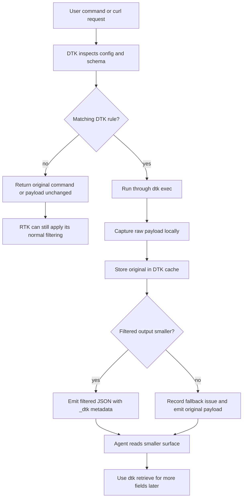

# DTK


DTK is Dynamic Token Killer for AI assistants.

It is inspired by RTK, but it solves a different problem: structured payloads, recoverable filtering, and selective retrieval after the fact. DTK keeps the original payload locally, exposes a smaller `_dtk` surface to the agent, and lets you pull back only the fields you need later.

## Quick Start

```bash
./install.sh
./install-dev.sh
dtk install
dtk install-dummy
```

Use `./install.sh` for the release-based install path and `./install-dev.sh` when you want to build and install from the local checkout.
Use `dtk install` for the default JSON dummyjson demo config.
Use `dtk install-dummy` when you want the broader bundled sample set, including the TOML Cargo.lock-style example, a TOML Python manifest example, a CSV inventory export example, a XAML ResourceDictionary example, the YAML Kubernetes example config, and their sample payloads.

The repo is pinned to the current stable Rust toolchain via `rust-toolchain.toml`. If your local `cargo` is too old and reports that `Cargo.lock` version `4` is unsupported, run `rustup update stable && rustup default stable` and retry.

After that, run a command through DTK:

```bash
dtk exec -- curl -sS https://dummyjson.com/users
```

DTK installs a default dummyjson sample config at `~/.config/dtk/configs/dummyjson_users.json`, then uses it automatically when no explicit config is passed. It stores the original payload locally so you can recover more fields later.
`dtk install-dummy` also installs `~/.config/dtk/configs/cargo_lock_packages.toml.json`, `~/.config/dtk/samples/cargo_lock_packages.toml`, `~/.config/dtk/configs/pyproject_manifest.toml.json`, `~/.config/dtk/samples/pyproject_manifest.toml`, `~/.config/dtk/configs/csv_inventory_export.csv.json`, `~/.config/dtk/samples/csv_inventory_export.csv`, `~/.config/dtk/configs/xaml_resource_dictionary.xaml.json`, `~/.config/dtk/samples/xaml_resource_dictionary.xaml`, `~/.config/dtk/configs/kubernetes_deployment.yaml.json`, and a checked-in sample YAML payload at `~/.config/dtk/samples/kubernetes_deployment.yaml`.

Before, the payload is the full API response:

```json
{
  "users": [
    {
      "id": 1,
      "firstName": "Emily",
      "lastName": "Johnson",
      "maidenName": "Smith",
      "age": 28,
      "gender": "female",
      "email": "emily.johnson@example.com",
      "phone": "+1-202-555-0148",
      "username": "emilyj",
      "image": "https://example.com/users/1.png",
      "birthDate": "1997-05-21",
      "university": "Northwestern University",
      "address": {
        "city": "Seattle",
        "state": "WA",
        "country": "United States"
      },
      "company": {
        "name": "Northwind",
        "title": "Product Manager",
        "department": "Operations"
      },
      "bank": {
        "cardType": "Mastercard",
        "cardExpire": "08/28"
      },
      "crypto": {
        "coin": "Bitcoin",
        "wallet": "0x1234"
      },
      "hair": {
        "color": "Brown",
        "type": "Wavy"
      }
    }
  ]
}
```

After DTK filters it, the agent sees a smaller `_dtk` surface:

```json
{
  "_dtk": {
    "ref_id": "dtk_...",
    "available_fields": ["users[]", "users[].firstName", "users[].lastName", "users[].age", "users[].gender"],
    "content_path": "users"
  },
  "users": [
    {
      "firstName": "Emily",
      "lastName": "Johnson",
      "age": 28,
      "gender": "female"
    }
  ]
}
```

If you need more fields later, use the `_dtk.ref_id` from the filtered output:

```bash
dtk retrieve <ref_id> 'users[0].firstName,users[0].lastName'
```

If you decide the field should be exposed by default next time, update the config through DTK instead of editing JSON by hand:

```bash
dtk config list
dtk config allow add dummyjson_users.json '[].hair.color'
dtk config allow remove dummyjson_users.json '[].hair.color'
dtk config delete dummyjson_users.json
```

## How DTK Works



DTK works as a structured routing layer, not a hard replacement for RTK.

- It looks for a matching config or schema first.
- If it finds one, DTK filters the payload, stores the original locally, and gives the agent a smaller surface plus a `ref_id` for later recovery.
- If the filtered output would be larger than the original, DTK records that as a fallback issue and returns the original payload instead.
- If it does not find a match, DTK returns the original command or payload unchanged, so RTK can still do its normal token-saving work.

## How to Add Configuration

DTK can install an optional configuration skill during setup.

Use it when you want DTK to turn a live `curl` request or API response into a reusable config, then refine that config later with native `dtk config ...` commands without starting over.

They help by:

- inspecting the live payload
- asking which fields should stay visible
- asking which fields should be hidden
- drafting the matching DTK config
- registering the hook rule for later reuse
- tuning an existing config by expanding or shrinking its allowlist with `dtk config allow add` and `dtk config allow remove`

How to use it:

```bash
dtk install
dtk install-dummy
```

During install, DTK asks whether you want the skill installed. Choose `Yes` if you want help building configs from live payloads and tuning them later. Choose `No` if you only want the binaries and will manage configs yourself.
`dtk install` keeps the default JSON sample small for first-run experience. `dtk install-dummy` installs all bundled sample configs that match currently supported formats.

The setup flow is interactive. The agent can keep refining the config by asking things like:

- which fields matter for decisions
- which nested fields should stay visible
- which fields should be hidden
- whether the payload root is an object or an array

After a config already exists, DTK-native config commands can handle follow-up prompts like:

- increase the allowlist for `dummyjson_users.json` to include user email
- decrease the allowlist for the `n8n_workflows_list` rule and hide archived metadata
- inspect the current filtered output, then tighten the config without recreating it

Example prompt:

```text
Use the DTK Config Assistant for this command:

curl -sS https://dummyjson.com/users

Please inspect the response, identify the fields that are likely needed, ask me which fields should stay visible or be hidden, and draft the DTK configuration.
```

That makes the config more accurate than hardcoding one guess up front.

## RTK vs DTK

For the same `curl` request, the output shape is different:

| Command | Output | Tokens |
|---|---|---:|
| `rtk curl -sS https://dummyjson.com/users` | compact summary of the payload | `218` |
| `rtk proxy curl -sS https://dummyjson.com/users` | raw original JSON | `17243` |
| `dtk exec -- curl -sS https://dummyjson.com/users` | filtered JSON plus `_dtk` metadata | `4788` |

`rtk curl` is the smallest, but it is intentionally compressed. `rtk proxy curl` keeps the full raw response, but it is expensive for the model to read. DTK sits in the middle: it trims the surface the agent sees, keeps the original payload locally, and exposes `_dtk.ref_id` so the agent can retrieve more fields later when needed.

DTK is useful when you want the model to see real data, not just a summary, without paying the full token cost of the original payload.

`dtk exec` also supports YAML command output when the command emits a YAML mapping or sequence. DTK parses it into the same filtered JSON surface and stores the original YAML for later retrieval.

`dtk exec` also supports TOML command output when the command emits a TOML table or array of tables. DTK parses it into the same filtered JSON surface and stores the original TOML for later retrieval.

`dtk exec` also supports XAML/XML command output when the command emits a well-formed XML document. DTK parses it into the same filtered JSON surface and stores the original XML for later retrieval. This is practical for WPF, WinUI, MAUI, and other .NET UI files such as `App.xaml` or resource dictionaries.

When a source needs an explicit parser choice, add an optional `format` field to the config, for example `"format": "yaml"`, `"format": "toml"`, `"format": "csv"`, or `"format": "xaml"`.

CSV is a good fit for inventory exports, reporting dumps, and other tabular data where repeated columns should be preserved but low-value fields can be trimmed away.

Example:

```bash
dtk exec --config kubectl_pods.yaml.json -- \
  kubectl get pods -o yaml

dtk exec --config cargo_lock_packages.toml.json -- \
  cat Cargo.lock

dtk exec --config pyproject_manifest.toml.json -- \
  cat pyproject.toml

dtk exec --config xaml_resource_dictionary.xaml.json -- \
  cat App.xaml
```

Examples:

`rtk curl`
```json
{
  "users": {
    "count": 30,
    "fields": ["id", "firstName", "lastName", "age", "gender"],
    "note": "compressed summary"
  }
}
```

`rtk proxy curl`
```json
{
  "users": [
    {
      "id": 1,
      "firstName": "Emily",
      "lastName": "Johnson",
      "maidenName": "Smith",
      "age": 28,
      "gender": "female",
      "email": "emily.johnson@example.com",
      "phone": "+1-202-555-0148"
    }
  ]
}
```

`dtk exec`
```json
{
  "_dtk": {
    "ref_id": "dtk_...",
    "available_fields": [
      "users[]",
      "users[].firstName",
      "users[].lastName",
      "users[].age",
      "users[].gender"
    ],
    "content_path": "users"
  },
  "users": [
    {
      "firstName": "Emily",
      "lastName": "Johnson",
      "age": 28,
      "gender": "female"
    }
  ]
}
```

You can also combine DTK and RTK in one command:

```bash
rtk dtk exec -- git status
```

In that flow, DTK checks for a matching config first. If DTK has no config or schema for the command, it returns the original command unchanged, so the combined `rtk dtk exec -- <command>` path still works without special casing.

## Commands

- `dtk exec`
- `dtk retrieve`
- `dtk cache list`
- `dtk cache show <ref_id>`
- `dtk gain`
- `dtk session`
- `dtk doctor`
- `dtk install`
- `dtk install-dummy`
- `dtk uninstall`
- `dtk hook add`
- `dtk version`

### Gain

`dtk gain` examples:

```bash
dtk gain
dtk gain --json
dtk gain --ticket-id ticket-123
dtk gain --group-by domain
dtk gain --group-by command
dtk gain --group-by details
dtk gain --group-by signature
dtk gain --all
dtk gain --daily
dtk gain --weekly
dtk gain --monthly
```

Grouping modes:

- `command` groups by executable name, like `curl` or `git`
- `domain` groups `curl` usage by host, like `dummyjson.com`
- `details` groups by the normalized full command line
- `signature` groups by the full command, domain, and details triple
- `ticket-id` filters the report to one session ticket

### Session

```bash
dtk session start
dtk session start --ticket-id ticket-123
dtk session end
```

While a session is active, DTK writes the session ticket into each metrics row. That lets you scope later reports with `dtk gain --ticket-id ticket-123`.

## Development

- `cargo test`
- `cargo fmt --check`
- `dtk doctor`

## Contributing

Branch protection and PR-only merges are configured on GitHub, not in the repo itself. See [CONTRIBUTING.md](CONTRIBUTING.md) for the expected workflow.

## Roadmap

1. Expand DTK beyond the current `curl` / JSON-focused workflow.
2. Add PII-aware filtering.
3. Improve TUI and GUI management.
4. Add more release and distribution methods.

## License

MIT
